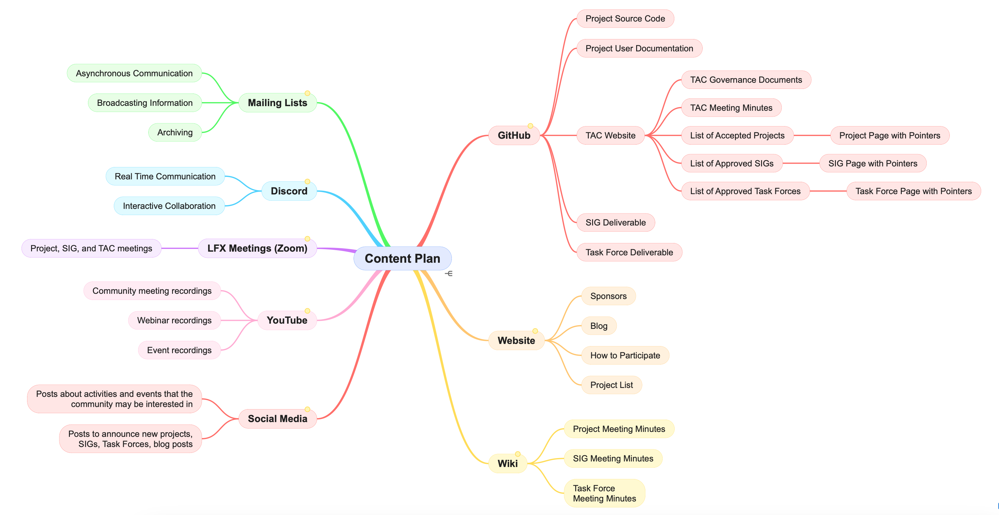

# Content Plan

This document provides details about the different channels that we have within the OpenWallet Foundation and what we expect each to be used for.

<table>
  <thead>
    <tr>
      <th>
<b>Channel</b>
</th>
      <th>
<b>What</b>
</th>
      <th>
<b>Roles</b>
</th>
    </tr>
  </thead>
  <tr>
    <td>
<b><a href="https://discord.gg/openwalletfoundation">Discord</a></b>
</td>
    <td><ul><li><b>Real-Time Communication:</b> Chat services facilitate real-time, synchronous communication among users. Messages are sent and received instantly, enabling quick exchanges and conversations.</li><li><b>Interactive Collaboration:</b> Chat services are well-suited for interactive collaboration, allowing users to engage in live discussions, share files, collaborate on documents, and even conduct video calls in some cases.</li></ul></td>
    <td>
<b>Staff:</b> Administers, creates new channels, and moderates

<b>Community:</b> Sends messages and monitors
</td>
  </tr>
  <tr>
    <td>
<b><a href="https://lists.openwallet.foundation">Mailing Lists</a></b>
</td>
    <td><ul><li><b>Asynchronous Communication:</b> Mailing lists are primarily used for asynchronous communication. Users send messages to a central email address, which are then distributed to all subscribers. Subscribers can read and respond to messages at their convenience.</li><li><b>Broadcasting Information:</b> Mailing lists are effective for broadcasting information to a group of subscribers. They are commonly used for announcements, discussions, and sharing updates within a community or organization.</li><li><b>Archiving:</b> Mailing lists typically archive messages, allowing subscribers to access past discussions and reference previous communications. This archival feature can be valuable for maintaining a record of conversations and facilitating knowledge sharing.</li></ul></td>
    <td>
<b>Staff:</b> Administers, creates new lists, and moderates

<b>Community: </b>Sends messages and monitors
</td>
  </tr>
  <tr>
    <td>
<b><a href="https://github.com/openwallet-foundation">GitHub</a></b>
</td>
    <td><ul><li><b>Project-Based Source Code and User Documentation:</b> Any source code for projects should utilize GitHub. GitHub pages should be used for hosting user documentation.</li><li><b>TAC Governance Documentation and Other Relevant Information:</b> Governance documentation for the TAC must be version controlled. As such, GitHub is the appropriate place to store this information in addition to other relevant TAC materials. Currently https://tac.openwallet.foundation is generated from markdown files in GitHub.</li><li><b>SIG or Task Force Deliverables:</b> A separate repo can be set up for SIGs and Task Forces so that they can have versioned control support for their deliverables.</li></ul></td>
    <td>
<b>Staff:</b> Administers, creates new repos and teams

<b>Maintainers:</b> Reviews and handles issues and pull requests

<b>Community:</b> Use source,create issues, fork code, and contribute
</td>
  </tr>
  <tr>
    <td>
<b><a href="https://openwallet.foundation">Website</a></b>
</td>
    <td><ul><li><b>Blogs</b></li><li><b>Announcements</b></li><li><b>Native content</b></li><li><b>Events and Conferences</b></li></ul></td>
    <td>
<b>Staff: </b>Administers and determines contents

<b>Community: </b>Visit and contribute blog posts
</td>
  </tr>
  <tr>
    <td>
<b><a href="https://wiki.openwallet.foundation">Wiki</a></b>
</td>
    <td><ul><li><b>Project Meeting Minutes</b></li><li><b>SIG Meeting Minutes</b></li><li><b>Task Force Meeting Minutes</b></li><li><b>Collaborative Editing</b></li></ul></td>
    <td>
<b>Staff: </b>Administers and creates new spaces

<b>Community:</b> Creates and edits pages
</td>
  </tr>
  <tr>
    <td>
<b><a href="https://openprofile.dev/my-meetings">LFX Meetings (Zoom)</a></b>
</td>
    <td><ul><li><b>Project, SIG, and TAC meetings:</b> All project, SIG, and TAC meetings must be held using LFX meetings. This ensures that a recording of the meeting is captured and available for people to catch up on what they may have missed. Send an email to <a href="mailto:operations@openwallet.foundation">operations@openwallet.foundation</a> to get your meetings scheduled.</li></ul></td>
    <td>
<b>Staff: </b>Administers and creates new meetings

<b>Community:</b> Attends meetings and listen to recordings
</td>
  </tr>
  <tr>
    <td>
<b><a href="https://www.youtube.com/@openwallet_fdn">YouTube</a></b>
</td>
    <td><ul><li><b>Community meeting recordings</b></li><li><b>Webinar recordings</b></li><li><b>Event recordings</b></li></ul></td>
    <td>
<b>Staff: </b>Administers and adds videos and playlists

<b>Community:</b> Watch videos
</td>
  </tr>
  <tr>
    <td>
<b>Social Media</b>
<ul><li><a href="https://twitter.com/OpenWallet_Fdn">Twitter</a></li><li><a href="https://www.linkedin.com/showcase/open-wallet-foundation/">LinkedIn</a></li></ul></td>
    <td><ul><li>Posts about activities and events that the community may be interested in</li><li>Posts to announce new projects, SIGs, Task Forces, blog posts</li></ul></td>
    <td>
<b>Staff:</b> Administers and posts content

<b>Community:</b> Reads content
</td>
  </tr>
</table>

