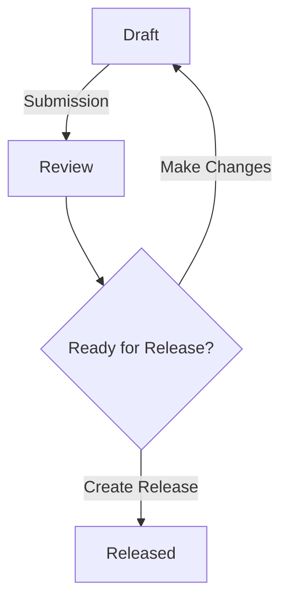

# Publishing Deliverables in the OpenWallet Foundation Community

## Overview

This document outlines the process for publishing deliverables in the OpenWallet Foundation technical community. These deliverables will be created by either [task forces](./task-force-process.md) or [special interest groups](./special-interest-group-process.md). The types of deliverables they can create depend on their goals, 
objectives, and scope. Here are some examples:

1. **Reports**: Summarize findings or recommendations.  These might be formal or informal.
1. **Action Plans**: Outline the steps necessary to address a particular challenge or problem. These plans might include specific tasks, timelines, and responsible individuals.
1. **Recommendations**: Provide guidance or proposals for solving problems, improving processes, or addressing gaps.
1. **Guidelines**: Outline best practices or procedures for a specific industry, domain, or project.
1. **Templates and Tools**: Serve as a starting point for creating new content and help users complete tasks, solve problems, or achieve specific goals frameworks that can be used by others.
1. **Whitepapers**: Provide detailed analysis, data, or insights to help others understand a particular issue or opportunity. These are typically in-depth reports on complex topics.
1. **Case Studies**: Illustrate the impact of real-world examples or hypothetical scenarios, including recommendations or findings.
1. **Frameworks and Models**: Describe how to approach a particular problem or challange through conceptual frameworks, models, or architectures.
1. **Surveys and Research Reports**: Gather data or validate hypotheses via surveys, interviews, or research studies, culminating in reports summarizing findings.
1. **Best Practices and Playbooks**: Outline best practices for specific scenarios, industries, or processes, providing guidance on how to navigate complex situations.
1. **Metrics and KPIs**: Determine how to measure progress toward goals or track the effectiveness of initiatives.
1. **Process Improvements**: Identify areas for process improvement and develop new procedures, workflows, or tools to streamline operations or enhance efficiency.
1. **Training and Education Materials**: Equip others with the knowledge and skills needed to tackle a specific challenge. Might include items such as curricula, tutorials, or guides.
1. **Scoping Documents**: Outline the scope, objectives, and deliverables of a project, ensuring everyone is on the same page.
1. **Lessons Learned Reports**: Summarize learnings, what worked well, and what didn't.

## Process

There are three stages of an OWF deliverable -- draft, review, and released.

A deliverable begins as a "draft" and retains this status until submitted to the community for review. At this point, the deliverable will be considered to be in the "review" stage and retains this status until the review period has ended. After the review period has ended, the task force or special interest group will determine if the deliverable is ready for release. If the task force or special interest group chooses to make changes, the deliverable will return to a "draft" stage where they can address the concerns of the community. The task force or special interest group can also determine that the deliverable is ready for release. In which case, a "released" version can be created. See [required contents](#required-contents) for more information on what should be included within a "released" deliverable.

### Draft

During the "draft" stage, the deliverable is being prepared by the task force or special interest group. This includes writing the technical content and ensuring that it meets the standards of the OWF technical community. If there are any concerns about the technical content that cannot be addressed by consensus of the task force or special interest group members, then the community may address these concerns during the "review" stage.

### Submission

The task force or special interest group lead may submit a version of their deliverable to the community for review. They can do this by sending an email to the [TAC mailing list](mailto:tac@lists.openwallet.foundation). The email should include the following information:

- A brief description of the deliverable.
- A link to the deliverable. Ideally, this should be a link to a pull request that contains the version of the deliverable where people in the community will be able to provide their feedback.
- A link to the task force or special interest group that submitted the deliverable.

### Review

The applicable period to review a submitted deliverable will be no shorter than four weeks. The community will make reasonable efforts to provide feedback on the submitted version during the review period and provide any critical comments or objections, with sufficient specificity for the task force or special interest group members to respond and, if required, to facilitate resolution. 

!!! info

    Comments and feedback can be provided by anyone in the OWF community.

### Ready for Release

After the applicable review period has elapsed, the task force or special interest group members can review the feedback received and determine if the deliverable is ready for review. If the task force or special interest group chooses to make changes, the deliverable will return to a "draft" stage where they can address the concerns of the community. The task force or special interest group can also determine that the deliverable is ready for release. In which case, a "released" version can be created. 

### Released

The task force or special interest group should ensure that the [required contents](#required-contents) are included in any release.

## Required Contents

### Copyright Notice

The copyright notice must be included in all versions of the deliverable. The copyright notice should include the OpenWallet Foundation as well as the year of publication.

!!! quote

    Copyright (c) 2024 OpenWallet Foundation.

### License Notice

The license notice must be included in all versions of the deliverable. The license notice should include a reference to the CC-BY-4.0 license.

!!! quote

    These materials are made available under and are subject to the Creative Commons Attribution 4.0 International license (http://creativecommons.org/licenses/by/4.0/legalcode).

### "Non-Representative" Disclaimer

A "non-representative" disclaimer should be included in all versions of the deliverable. The "non-representative" disclaimer should include the following text:

!!! quote

    These materials are a deliverable of the _sig name_ SIG and were created by the contributors to that SIG. It has not been reviewed, approved, or endorsed by the OpenWallet Foundation ("OWF") and its members.
