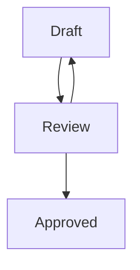

# Publishing Papers in the OpenWallet Foundation Community

## Overview

This document outlines the process for publishing papers in the OpenWallet Foundation technical community. These papers will be created as deliverables by either [task forces](./task-force-process.md) or [special interest groups](./special-interest-group-process.md).

## Process

There are three stages of an OWF paper -- draft, review, and approved.

A paper begins as a "draft" and retains this status until submitted to the TAC for review. At this point, the paper will be considered to be in the "review" stage and retains this status until the TAC makes a decision. The TAC may reject the paper for various reasons. If the paper is rejected by the TAC then it will return to a "draft" stage where the community can address the concerns of the TAC. The paper may also be accepted by the TAC, in which case it will be published as an "approved" paper of the OWF technical community. Only after the paper is accepted, may the paper use the "OpenWallet Foundation" trademark. See [required contents](#required-contents) for more information on what should be included within an "approved" paper.

### Draft

During the "draft" stage, the paper is being prepared by the task force or special interest group. This includes writing the technical content and ensuring that it meets the standards of the OWF technical community. If there are any concerns about the technical content that cannot be addressed by consensus of the task force or special interest group members, then the community may address these concerns during the "review" stage.

### Submission

The task force or special interest group lead may submit a version of their paper to the Technical Advisory Committee (TAC) for review. They can do this by sending an email to the [TAC mailing list](mailto:tac@lists.openwallet.foundation). The email should include the following information:

- A brief description of the paper.
- A link to the paper. Ideally, this should be a link to a pull request that contains the version of the paper where people in the community and the TAC voting members will be able to provide their feedback.
- A link to the task force or special interest group that submitted the paper.

### Review

The applicable period to review a submitted paper will be no shorter than four weeks. The TAC will make reasonable efforts to provide feedback on the submitted version during the review period and provide any critical comments or objections, with sufficient specificity for the task force or special interest group members to respond and, if required, to facilitate resolution. 

!!! tip

    Comments can be provided by anyone in the OWF community.

### TAC Decision

After the applicable review period has elapsed, the submitted paper will be discussed at the next TAC meeting. The TAC will make a decision to approve, reject, or request changes based on the feedback provided during the review period. To be approved, the paper must receive a two-thirds supermajority vote of the TAC.

If there is not agreement to recommend approval, the paper will return to a "draft" status where the community can address the concerns of the TAC and re-submit for review after the concerns have been addressed.

### Changes

No substantive changes may be made to an "approved" paper; substantive changes will require review and approval of a successor version of the paper. A **substantive change** refers to a modification that significantly affects the content, meaning, or interpretation of an "approved"paper.

## Required Contents

### Copyright Notice

The copyright notice must be included in all versions of the paper. The copyright notice should include the OpenWallet Foundation as well as the year of publication.

!!! example

    Copyright (c) 2024 OpenWallet Foundation.

### License Notice

The license notice must be included in all versions of the paper. The license notice should include a reference to the CC-BY-4.0 license.

!!! example

    This work is licensed under a Creative Commons Attribution 4.0 International License (CC BY 4.0).

### Terms of Use Notice

The terms of use notice must be included in all versions of the paper. The terms of use notice should include the following text:

!!! quote

    These materials are made available under and are subject to the Creative Commons Attribution 4.0 International license (http://creativecommons.org/licenses/by/4.0/legalcode).

    THESE MATERIALS ARE PROVIDED “AS IS.” The OpenWallet Foundation ("OWF") and its members and contributors (each of OWF, its members and contributors, a "OWF Party") expressly disclaim any warranties (express, implied, or otherwise), including implied warranties of merchantability, non-infringement, fitness for a particular purpose, or title, related to the materials. The entire risk as to implementing or otherwise using the materials is assumed by the implementer and user. 

    IN NO EVENT WILL ANY OWF PARTY BE LIABLE TO ANY OTHER PARTY FOR LOST PROFITS OR ANY FORM OF INDIRECT, SPECIAL, INCIDENTAL, OR CONSEQUENTIAL DAMAGES OF ANY CHARACTER FROM ANY CAUSES OF ACTION OF ANY KIND WITH RESPECT TO THESE MATERIALS, ANY DELIVERABLE OR THE OWF GOVERNING AGREEMENT, WHETHER BASED ON BREACH OF CONTRACT, TORT (INCLUDING NEGLIGENCE), OR OTHERWISE, AND WHETHER OR NOT THE OTHER PARTY HAS BEEN ADVISED OF THE POSSIBILITY OF SUCH DAMAGE.