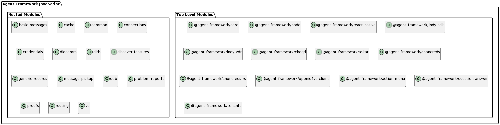

# Agent Framework JavaScript

## Project Description

Agent Framework JavaScript has evolved significantly since its inception as a Hyperledger Aries project. Initially, it heavily relied on Hyperledger standards such as DIDComm, Indy, and AnonCreds. However, with advancements in verifiable credential technology and the emergence of new standards, the framework underwent multiple refactoring and modularization processes to maintain interoperability.

This allowed for the inclusion of non-Hyperledger standards like W3C Verifiable Credentials with Data Integrity Proofs, DIF Presentation Exchange, OpenID4VC, and SD-JWT integration. As industry requirements shifted towards greater modularity, it became apparent that a unified framework may be better.

The future direction for Agent Framework JavaScript involves adopting a compartmentalized approach consisting of single-purpose libraries designed to work together seamlessly, building on what is already out there. This transition will take considerable effort and will, therefore, be gradual.

In order to expand the framework's support for standards beyond the Hyperledger ecosystem, a reassessment of its governance was necessary. The OpenWallet Foundation (OWF) was chosen as a steward due to its commitment to promoting interoperability without directly developing or maintaining standard protocols.

<!---
## Source Repositories

- [openwallet-foundation/agent-framework-javascript](https://github.com/openwallet-foundation/agent-framework-javascript)
- [openwallet-foundation/agent-framework-javascript-ext](https://github.com/openwallet-foundation/agent-framework-javascript-ext)
--->

## Chat Channel
- [#agent-framework-js](https://discord.com/channels/1022962884864643214/1179453305856991263) on the [OpenWallet Foundation Discord server](https://discord.gg/openwalletfoundation)
