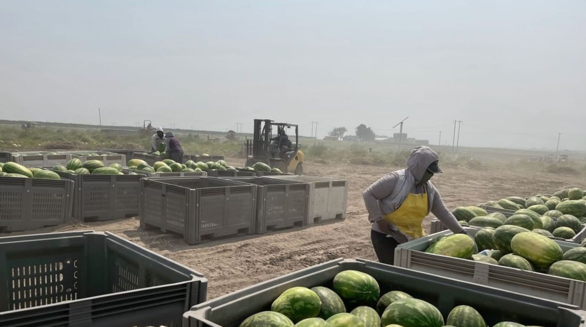
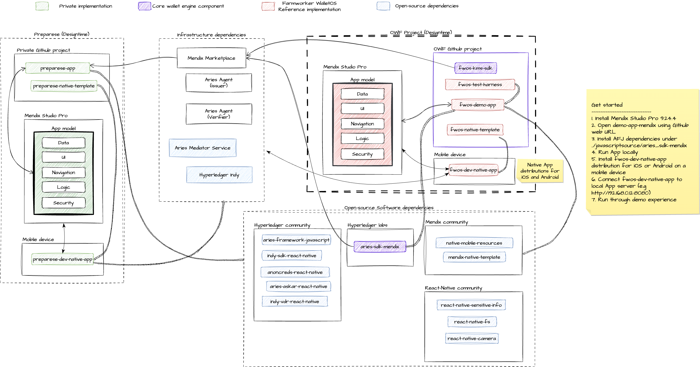

# Farmworker Wallet OS

## Project Description

The **Farmworker Wallet OS**  project is a community of contribution led by [Entidad](https://www.entidad.io/) and the [United Farm Workers Foundation](https://www.ufwfoundation.org/) (UFWF) with the goal of furthering the adoption of an open, secure, interoperable digital wallet engine that makes it easier for farmworker communities to access an ecosystem of life-altering social and human services. 

Farmworkers are the backbone of global food supply chains, yet they remain one of the most underserved segments of our population. Governments around the world deemed them ‘Essential’ during the recent pandemic. While services and programs exist to help, it’s challenging and costly for organizations that provide them to securely collect and verify the information needed to prove applicant eligibility claims.  As a result, most farmworkers forego services and resources they need, even though they’re eligible for them.  

Over the last three years, Entidad and the UFW Foundation have been exploring digital trust technologies to solve this problem. We’ve developed PrepareseTM, a digital infrastructure solution that lets farmworker organizations securely reuse verified farmworker information, eliminating the need for repetitive collection. The solution layers didcomm, wallet, decentralized identifiers, and verifiable credential technologies with a low-code application development platform, [Mendix](https://www.mendix.com/).  

Mendix has been a key component in making the PrepareseTM solution possible. Low-code software development has been growing in popularity and bringing new audiences to the practice. Mendix, one of the more popular platforms with over 300K active developers and 50M users, has enabled Entidad and the UFW Foundation to develop, launch, and maintain enterprise-grade digital trust enabled solutions that solve real world problems. 

We’ve built two products, using this technology. For organizations we’ve built Preparese PlatformTM, it allows them to quickly develop and launch digital trust enabled services and programs. For farmworkers, we’ve developed Preparese MobileTM which combines a verifiable digital profile with a suite of tools that simplify interactions with organizations on the platform. 
 
The Preparese PlatformTM is being used by 9 organizations and has 5 digital services in production. The most recent service launched is being used to process and distribute [$80 million](https://www.usda.gov/media/press-releases/2021/09/07/usda-invests-700-million-grants-provide-relief-farm-and-food) in one-time relief payments to over 125,000 workers, under the United States Department of Agriculture’s [Farm and Food Workers Relief Program](https://www.ams.usda.gov/services/grants/ffwr) (FFWR).  

The second product, Preparese MobileTM, is designed around the unique needs of farmworkers. We’ve developed a react native mobile app that lets farmworkers store, manage, and exchange their verified information. Engagement with organizations is made easier with [DIDComm](https://didcomm.org/book/v2/)-based communication capabilities such as text and video chat.  

One of the cornerstone technologies of the solution is an interoperable Mendix enabled digital wallet. The wallet components need to be able to engage with various non-profit, government, and philanthropic sources, each with their own technology stacks. For this reason, interoperability and working with open standard frameworks has been a priority. The project team members have participated in [TrustOverIP Foundation](https://trustoverip.org/), [Hyperledger Aries JS Working Group](https://wiki.hyperledger.org/display/ARIES/Aries+Framework+JavaScript), and various other communities, including [DID Communication Working Group](https://identity.foundation/working-groups/did-comm.html) and [OpenWallet Foundation](https://openwallet.foundation/) of late, to ensure we adhere to best practices and standards.       

While currently focused on farmworkers, the Mendix digital wallet engine can be used to help others. There are many other underserved communities that could benefit greatly from the privacy, accessibility, and security digital wallets can provide. With this social impact purpose in mind and spirit of further collaboration, Entidad and the UFW Foundation propose to open source the digital wallet engine used in their PrepareseTM solution. By making these resources available, we hope to facilitate a wide variety of social impact.  
 
Additionally, the project allows us to bridge and advance the interest of both the OpenWallet Foundation and Mendix communities.  By collaborating with the Mendix community, we not only have the ability to grow the number of digital trust technology practitioners, we also tap into a community with an established customer base. By making digital wallets components that can be easily integrated into their existing solutions, the project can drive further adoption and usage of interoperable, secure and privacy preserving digital wallets. 

## Origin & History 

The origins of the **Farmworker Wallet OS** project align with those of Entidad. What began as a volunteering effort by three college friends, was formalized in 2018 with the founding of Entidad as a public benefit corporation.  We have primarily been working with leading farm worker-serving organizations to develop technology that leverages growing digital literacy in their communities to scale their impact.  

The first digital service launched supported the UFW Foundation’s emergency relief efforts during the height of the COVID-19 pandemic. The solution was used to plan, manage and operate over 500 in-person community events where over $15 million in resources were distributed to over 40K families. Additionally, it has allowed us to better understand the unique challenges of building for underserved communities and why interoperable, secure, and privacy preserving technologies are key to addressing these challenges.  

You can read more about our journey on [our blog](https://www.entidad.io/blog). 

## External Dependencies

Mendix is a low-code application platform provider so its terms of service cover usage of Mendix services and resources by Mendix developers (organizations and/or individual contributors). The **Application model**  for a standards compliant wallet engine will be the primary focus for the contributors of this project. The Mendix terms of service do protect the IP rights to these App models in Section 3 with reference to "Customer Data" definition in section 17.

There are [design-time](https://www.mendix.com/evaluation-guide/developing-in-mendix/) and [runtime](https://www.mendix.com/evaluation-guide/app-lifecycle/deployment/) aspects of app development but one of the great things about this tooling is that there is clean separation between the two. 

The following captures the developer's "design-time" perspective. We hope that the diagram helps to clarify the software components that would fall under the scope of this OWF project and distinguishes PrepareseTM as an example of a closed (proprietary) application that embeds core Farmworker WalletOS components. We plan on documenting a similar diagram to aid in understanding the "runtime" perspective soon.

1. [Mendix Studio Pro v9.24.4](https://marketplace.mendix.com/link/studiopro/) (integrated developer environment) 
2. [Eclipse Temurin JDK 11 (x64)](https://adoptium.net/temurin/releases/?version=11)
3. [Mendix Native Template v7.0.1](https://docs.mendix.com/refguide9/mobile/distributing-mobile-apps/building-native-apps/native-template/)
4. [React Native v0.70.7](https://reactnative.dev/versions)
5. [Hyperledger / Aries-Framework-Javascript v0.4.0](https://github.com/hyperledger/aries-framework-javascript/releases/tag/v0.4.0)
6. Development instance of an [Aries Mediator Service](https://github.com/hyperledger/aries-rfcs/tree/main/concepts/0046-mediators-and-relays) 
7. Development instance of an [Aries Cloud Agent](https://github.com/hyperledger/aries-rfcs/tree/main/concepts/0004-agents) 

## Infrastructure

The **Farmworker Wallet OS** will be organized and published as a suite of software modules that can be imported into any existing Mendix app code repository. The Mendix software modules effectively serve as a digital wallet SDK that can be embedded into any Mendix application to enhance the user experience. The code repository for this project is itself a Mendix app repository and as such can be executed locally on any [supported](https://docs.mendix.com/refguide9/system-requirements/) developer workstation. 

The initial version of the digital wallet SDK is being built on top of [Aries Framework Javascript](https://github.com/hyperledger/aries-framework-javascript), an open-source framework maintained by the [Hyperledger Aries developer community](https://www.hyperledger.org/use/aries) helping to foster participation with the [Aries digital trust ecosystem](https://github.com/hyperledger/aries-rfcs). Over time, the digital wallet SDK will be extended to support other digital trust open standards such as [OpenID for Verifiable Credentials (OID4VC)](https://openid.net/sg/openid4vc/specifications/).

## Source Repositories

- [openwallet-foundation-labs/fwos-demo-app](https://github.com/openwallet-foundation-labs/fwos-demo-app)
- [openwallet-foundation-labs/fwos-native-template](https://github.com/openwallet-foundation-labs/fwos-native-template)

## Chat Channel
- [#fwos](https://discord.com/channels/1022962884864643214/1138937641123987466) on the [OpenWallet Foundation Discord server](https://discord.gg/openwalletfoundation)
